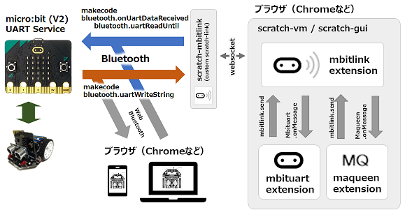

# mbitlink_hex

## micro:bit v1

- v1/microbit-ble_microbit.hex

	- micro:bit V1.5向けのプログラムで、micro:bitのセンサーを操作するプログラムです。
	- プログラムを修正するときは、https://makecode.microbit.org/v2 を使ってください。

- v1/microbit-ble_maqeen.hex

	- micro:bit V1.5向けのプログラムで、maqueenを操作するプログラムです。
	- プログラムを修正するときは、https://makecode.microbit.org/v2 を使ってください。

## micro:bit v2

- v2/microbit-ble_microbit_v2.hex

	- micro:bit V2向けのプログラムで、micro:bitのセンサーを操作するプログラムです。
	- プログラムを修正するときは、https://makecode.microbit.org または makecodeアプリを使ってください。

- v2/microbit-ble_maqeen_v2.hex

	- micro:bit V2向けのプログラムで、micro:bitのセンサーやmaqueenを操作するプログラムです。
	- プログラムを修正するときは、https://makecode.microbit.org または makecodeアプリを使ってください。

## 通信インターフェース

micro:bit と scratch-mbituart.exe 間は、Bluetooth LE の UARTサービス を使って会話しています。

## v1/custom.ts、v2/custom.ts について

- micro:bitからmaqueenを操作するためのソースコードです。
- DFROBOT社から公開されている pxt-maqueen v1.5.4 の一部を流用しています。
