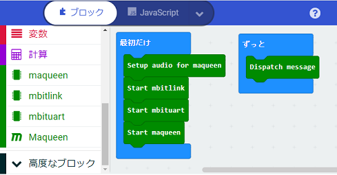

# mbitlink_hex

## micro:bit v1

- v1/microbit-ble_microbit.hex

	- micro:bit V1.5向けのプログラムで、micro:bitのセンサーを操作するプログラムです。
	- プログラムを修正するときは、https://makecode.microbit.org/v2 を使ってください。

- v1/microbit-ble_maqeen.hex

	- micro:bit V1.5向けのプログラムで、maqueenを操作するプログラムです。
	- プログラムを修正するときは、https://makecode.microbit.org/v2 を使ってください。

## micro:bit v2

- v2/microbit-ble_microbit_v2.hex

	- micro:bit V2向けのプログラムで、micro:bitのセンサーを操作するプログラムです。
	- プログラムを修正するときは、https://makecode.microbit.org または makecodeアプリを使ってください。

- v2/microbit-ble_maqeen_v2.hex

	- micro:bit V2向けのプログラムで、micro:bitのセンサーやmaqueenを操作するプログラムです。
	- プログラムを修正するときは、https://makecode.microbit.org または makecodeアプリを使ってください。

	

	- makecodeの拡張機能の組み込みで、mbitlink拡張機能と、利用形態にあわせてmbituart拡張機能、maqueen拡張機能を組み込んでください。 
	mbitlink拡張機能(通信部分): https://github.com/marron9999/lib-mbitlink 
	mbituart拡張機能(micro:bit操作): https://github.com/marron9999/lib-mbituart 
	maqueen拡張機能(maqueen操作): https://github.com/marron9999/lib-maqueen
	- 「最初だけ」に、それぞれの「Start」ブロックを配置してください。
	- 「ずっと」に、mbitlinkの「Dispatch」ブロックを配置してください。
	- maqueen拡張機能を使うときは、DFROBOT社から公開されているpxt-maqueeが必要です。 
	もし、エラー（プログラムサイズ制限）となってしまう場合は、アップロードされている custom.ts をかわりに組み込んでください。

## 通信インターフェース

micro:bit と scratch-mbituart.exe/ブラウザ は、Bluetooth LE の UARTサービス を使って会話します。

## v1/custom.ts、v2/custom.ts について

- micro:bitからmaqueenを操作するためのソースコードです。
- DFROBOT社から公開されている pxt-maqueen v1.5.4 の一部を流用しています。
